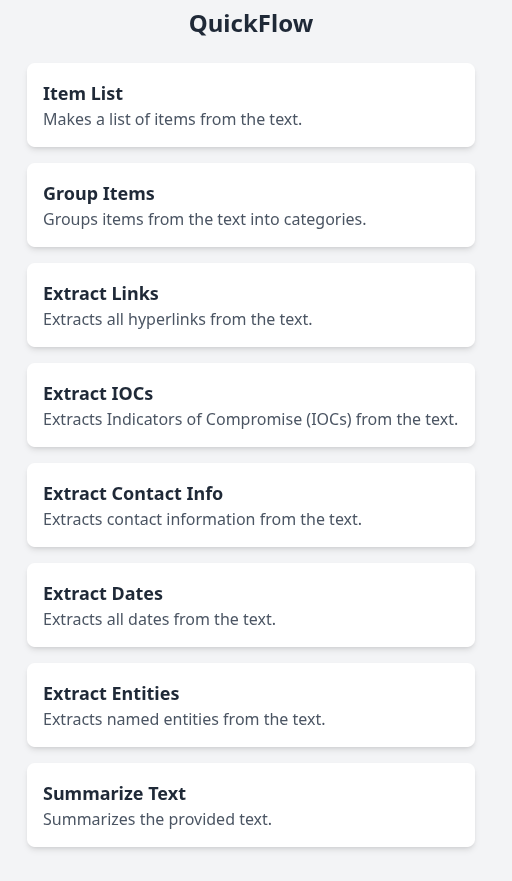
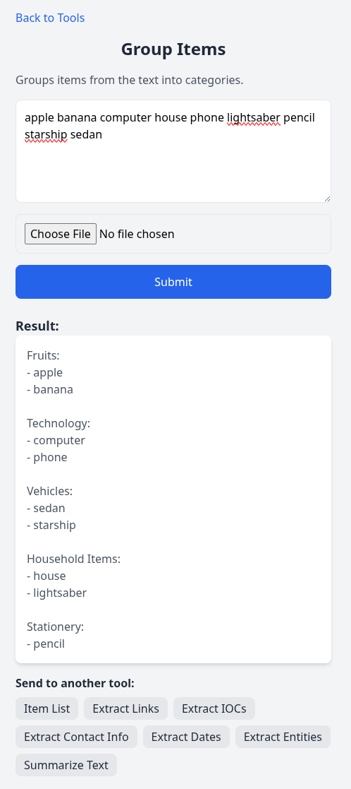

# QuickFlow

QuickFlow is a web application that enables easy processing of text and images through a sequence of predefined Large Language Model (LLM) tasks. It provides a simple interface for chaining various data extraction and analysis operations.

## Features

- **Text Processing**: Process text input through various LLM-powered tools
- **Image Processing**: Upload or capture images directly from your smartphone camera
- **Tool Chaining**: Send results from one tool as input to another tool
- **Predefined Tools**: Built-in tools for common tasks like:
  - Item List extraction
  - Link extraction
  - IOC (Indicators of Compromise) extraction
  - Contact information extraction
  - Date extraction
  - Named entity extraction
  - Text summarization
  - Item grouping/categorization

## Screenshots

 

## Setup

### Prerequisites

- Docker and Docker Compose
- OpenRouter API key (sign up at [openrouter.ai](https://openrouter.ai))

### Installation

1. Clone the repository:
```bash
git clone <repository-url>
cd QuickFlow
```

2. Set up your environment variables by editing the `docker-compose.yml` file:
```yaml
environment:
  - OPENROUTER_API_KEY=your_api_key_here
  - OPENROUTER_MODEL=google/gemma-3-27b-it:free
```

3. Build and run the application:
```bash
docker-compose up --build
```

4. Access the application at `http://localhost:5000`

### Manual Setup (without Docker)

1. Install Python dependencies:
```bash
pip install flask requests werkzeug
```

2. Set environment variables:
```bash
export OPENROUTER_API_KEY=your_api_key_here
export OPENROUTER_MODEL=google/gemma-3-27b-it:free
```

3. Run the application:
```bash
python app.py
```

## Usage

### Web Interface

1. **Select a Tool**: Choose from the available processing tools on the main page
2. **Input Data**: 
   - Enter text in the textarea, or
   - Upload an image file, or
   - Take a photo directly (on mobile devices)
3. **Process**: Click the Submit button to process your input
4. **Chain Tools**: Use the result as input for another tool by clicking on the tool buttons below the result

### Mobile Usage

QuickFlow is optimized for mobile devices:
- Use the camera capture feature to take photos directly
- Responsive design works well on smartphones and tablets
- Touch-friendly interface for easy navigation

### Available Tools

- **Item List**: Extracts a list of items from text or images
- **Group Items**: Categorizes items into logical groups
- **Extract Links**: Finds and extracts URLs and hyperlinks
- **Extract IOCs**: Identifies security indicators like IP addresses, domains, hashes
- **Extract Contact Info**: Finds names, emails, phone numbers
- **Extract Dates**: Identifies and extracts date information
- **Extract Entities**: Finds named entities (people, organizations, locations)
- **Summarize Text**: Creates concise summaries of longer text

### API Endpoints

- `GET /` - Serves the main web interface
- `GET /tools.json` - Returns the available tools configuration
- `POST /process` - Processes text or image input through the selected tool

## Configuration

### Adding Custom Tools

You can add custom tools by editing the `tools.json` file:

```json
{
  "name": "Your Tool Name",
  "description": "Description of what your tool does",
  "prompt": "Your prompt template with {input} placeholder",
  "structured": true
}
```

### Environment Variables

- `OPENROUTER_API_KEY`: Your OpenRouter API key (required)
- `OPENROUTER_MODEL`: The LLM model to use (default: google/gemma-3-27b-it:free)

## Technical Details

### Architecture

- **Frontend**: React-based SPA with Tailwind CSS
- **Backend**: Flask web server
- **LLM Integration**: OpenRouter API for model access
- **Image Processing**: Base64 encoding for image data

### File Structure

```
QuickFlow/
├── app.py              # Flask backend application
├── index.html          # Frontend React application
├── tools.json          # Tool definitions and prompts
├── Dockerfile          # Docker container configuration
├── docker-compose.yml  # Docker Compose setup
└── README.md          # This file
```

## Development

### Running in Development Mode

1. Enable debug mode by setting `FLASK_ENV=development`
2. Use volume mounting in docker-compose for live code reloading
3. Check the console logs for debugging information

### Contributing

1. Fork the repository
2. Create a feature branch
3. Make your changes
4. Test thoroughly
5. Submit a pull request

## License

MIT

## Support

For issues and questions, please [create an issue](https://github.com/Red5d/QuickFlow/issues) on the repository.
